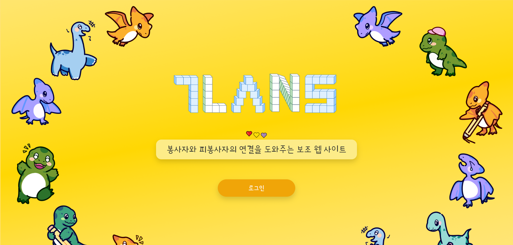
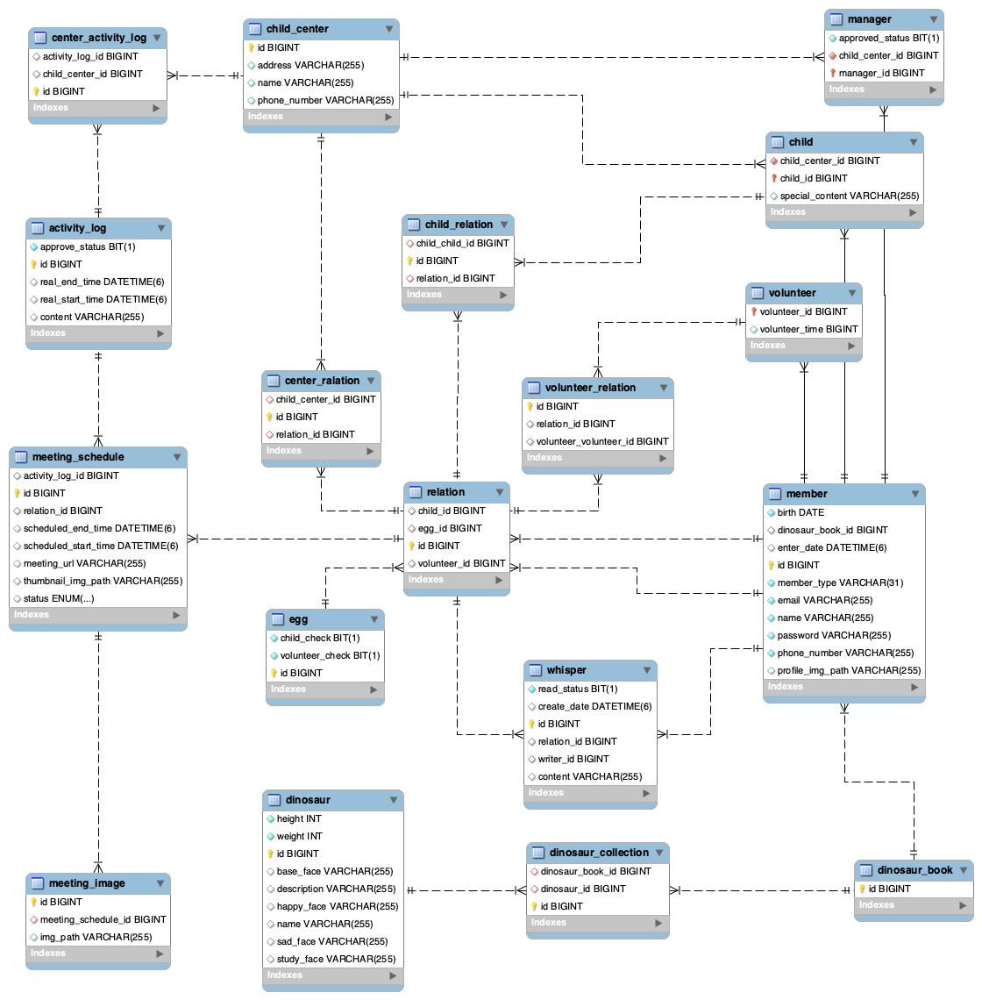
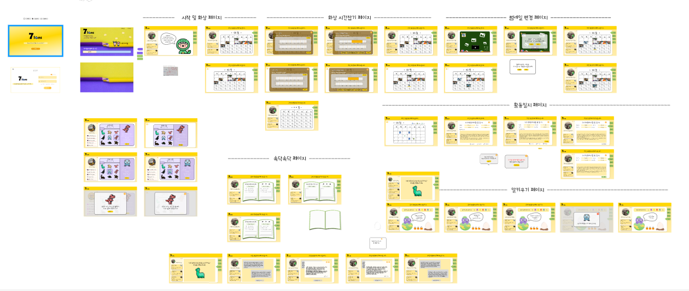
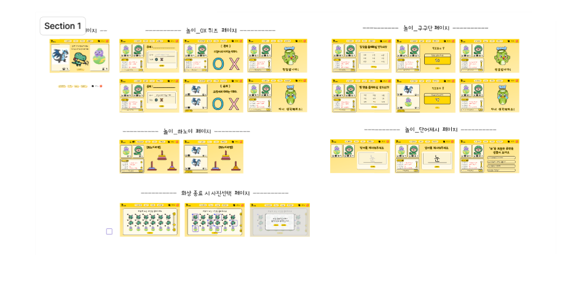
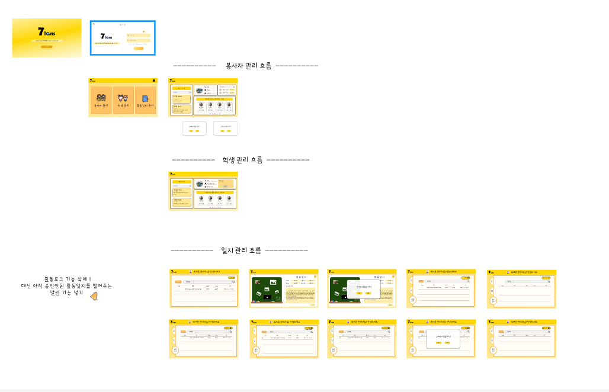
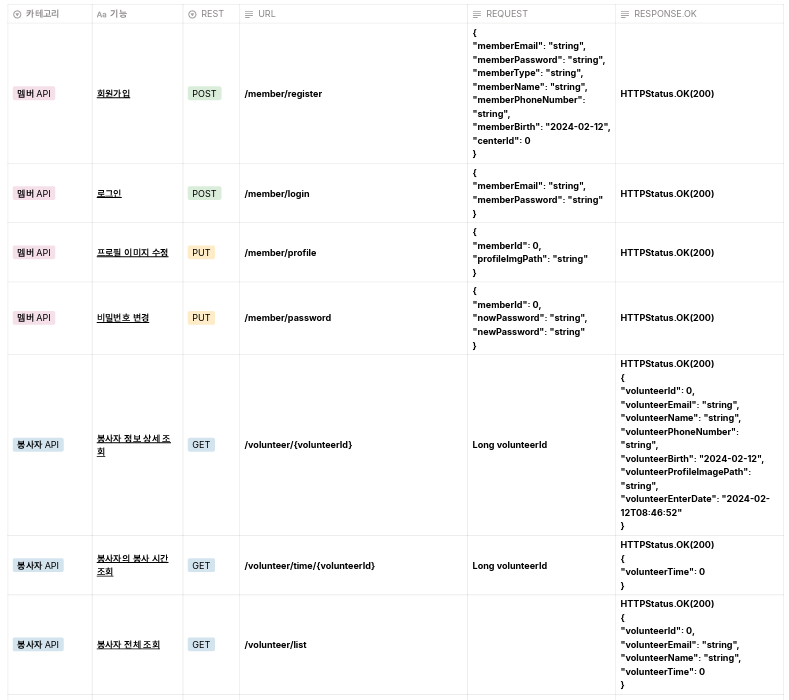

# 아동 & 봉사자 연결 플랫폼 

봉사자와 피봉사자의 연결을 도와주는 보조 웹 사이트 7lans입니다

# 🐣프로젝트 소개

지역 아동센터에 봉사활동을 갔다가 들었던 말

***"어차피 다시는 안 올거잖아요."***

봉사자들의 지속적이지 않은 활동으로 단절감을 느끼고 쉽게  마음을 열지 못하는 아이들을 위해, 지속적인 봉사를 하고싶은 봉사자들을 위해, 그 둘의 거리를 줄여주는 서비스 7lans입니다

### 주요 사용자

- 아동 센터의 초등학교 1~3학년 아동
- 아동에게 다가가고 싶지만 물리적 거리로 인해 자주 방문하기 힘든 봉사자
- 아동들이 다양하고 유대감이 있는 봉사자들을 만나게 해주고 싶은 아동 센터 담당자

### 주요 기능

- 놀이 및 교육 콘텐츠와 함께하는 화상 서비스 💻
- 아동과 봉사자가 서로에게 쪽지를 쓰는 속닥속닥 👂
- 지속적인 관계를 이어가고 유대감을 쌓을 수 있는 알 키우기와 공룡도감 🥚
- 봉사 시간과 활동 일지를 간편하게 온라인으로 조회 및 관리 가능 📃

# 🐣기능 소개

#### 1. 놀이 및 교육 컨텐츠와 함께하는 화상 만남
 - 화상 메인 화면

   
 - 캡쳐 기능 : 화상 채팅 중에 캡쳐한 사진들을 사진첩에 보관

 - OX퀴즈
 

 - 그림 맞추기 놀이

 - 구구단

 - 문장 만들기

#### 2. 봉사자와 아이가 주고 받는 쪽지, 속닥속닥

#### 3. 아이와 함께 부화해요, 알 키우기 및 공룡도감
속닥속닥과 화상일정으로 경험치를 쌓으면 알을 부화할 수 있어요

 - 알 부화하기

 - 공룡 도감

#### 4. 혼자서도 잘 놀아요, 말하는 공룡
알 키우기 화면에 있는 녹음기능으로 말을 따라하는 공룡과 함께해요

#### 4. 활동일지는 빠르고 간편하게
 - 작성 후 제출 : 작성은 음성으로도 가능합니다. 

 - 관리자가 승인한 이후
 

# 🐣시연 영상

# 🐣기술 스택
모션 캡쳐 api

# 🐣개발 환경

### **Back-end**
  - Java Version : Zulu JDK 17.44.15
  - SpringBoot Version: 3.2.1
      - spring.dependency-management version: 1.1.4
  - SpringFramework Version: 6.2.1
  - Spring Security: 3.2.1
  - JJWT: 0.11.5
  - Swagger: SpringDoc OpenAPI Starter WebMVC UI 2.3.0
  - Mysql-Server: 8.0.35
  - JUnit: 5

### **Front-end**
  - nodejs Version: 20.10.0
  - react Verson: 18.2
  - bootstrap Version: 2.10.0

### **CI/CD**
  - AWS EC2
  - Jenkins
  - Docker

### 서비스 아키텍처

# 프로젝트 일정 및 기타 산출물
### 프로젝트 일정

WBS 넣으면 됨

### ERD

### Figma 화면 정의서
#### 봉사자화면

#### 아동 화면

#### 관리자 화면

### API Interface

# 🐣개발 멤버 및 후기
멤버 각자 사진 1개씩 이름이랑 맡은 역할 넣기

후기작성하기.
